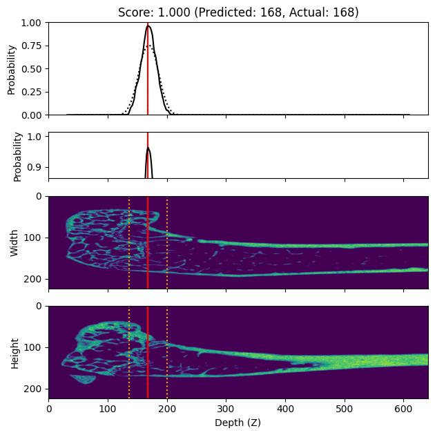

# Byte me if you can (BM) approach

The model trained as one of the six solutions in MiceBoneChallenge.

All code needed for training and running inference of BM model is below.

The trained model `models/0/model_0200.pth` is provided in a corresponding box folder.

## Installation

The `gpi_inferer` package, which contains both the model trainer and a corresponding predictor, can be installed via `pip` for local execution and developement:

```
pip install --editable .
```

## Setup

The model training can be configured by adjusting the default parameters defined in the `gpi_inferer.config` module. Before training, make sure that `images_path` and `metadata_path` in the `InputConfig` are pointing to the image data and the metadata table, respectively. The latter is expected to have a minimum set of columns named `Image Name`, `Growth Plate Index` (GPI), and `fold`.

## Training

To start a training, run the `train.py` script, providing at least a fold index and an output path:

```
mkdir -p models/0
python train.py -f 0 -o models/0
```

This will produce model checkpoints and a training log, as the training progresses. Please refer to the help message for all available command line options:

```
python train.py -h
```

## Inference

To perform a prediction on the training / validation data, run the `predict.py` script, providing one or more model checkpoints:

```
python predict.py -m models/0/model_0200.pth
```

This will produce a `csv` file next to the model checkpoint, containing the predicted GPIs and scores, as well as a `zarr` archive (containing additional, intermediate results).

To perform a prediction on arbitrary data, use the `Predictor` and `GPIInferer` directly, for example:

```python
from pathlib import Path

import pandas as pd
from gpi_inferer import Config, GPIInferer, Predictor, Trainer

metadata_path = Path("metadata.csv")
assert metadata_path.is_file()

images_path = Path("images_3d")
assert images_path.is_dir()

predictor = Predictor(
    metadata=pd.read_csv(metadata_path),
    images_path=images_path,
    trainer=Trainer(Config()),
    cache_rate=1,
)

model_path = Path("models/0/model_0200.pth")
assert metadata_path.is_file()

# Define the output paths.
data_path = model_path.with_suffix(".zarr")
csv_path = model_path.with_suffix(".csv")

# Perform the actual prediction.
predictor.load_model(model_path)
prediction = predictor.run(batch_size=128, data_path=data_path)

# Compute and aggregate the scores.
pd.DataFrame(
    [GPIInferer(name=name, data=data).as_dict() for name, data in prediction.items()]
).to_csv(csv_path, index=False)
```

### Visualization

To visualize the prediction results for individual cases, use the `Plotter` class:

```python
import matplotlib.pyplot as plt
from gpi_inferer import Config, GPIInferer, Plotter

plotter = Plotter(Config())

inf = GPIInferer(data_path="models/0/model_0200.zarr", name="32c1aa1bcd")

plotter.plot_prediction(inf, figsize=(6.4, 6.4))
plt.tight_layout()
plt.show()
```



# Results

## Test Set

The table below contains the GPIs predicted using the models corresponding to each training fold (`gpi_pred_0`, ...), as well as the rounded average predicted GPI (`gpi_pred`), and the respective score. The maximum absolute difference between the predicted and the true GPI is three slices, while the average difference is `-0.769231` slices, and the average score is `0.696837`.

| name       |   gpi_true |   gpi_pred |    score |   gpi_pred_0 |   gpi_pred_1 |   gpi_pred_2 |   gpi_pred_3 |   gpi_pred_4 |
|:-----------|-----------:|-----------:|---------:|-------------:|-------------:|-------------:|-------------:|-------------:|
| 22e989cc9b |        160 |        160 | 1.000000 |          162 |          158 |          160 |          158 |          160 |
| 5dd1c0c131 |        180 |        182 | 0.504985 |          182 |          182 |          182 |          182 |          182 |
| 64d33d4c9c |        182 |        180 | 0.504985 |          182 |          178 |          180 |          180 |          180 |
| 6eb0a13a01 |        169 |        167 | 0.504985 |          166 |          166 |          168 |          166 |          168 |
| 7081e041aa |        199 |        198 | 0.738883 |          196 |          198 |          198 |          198 |          198 |
| 8c9b119aa2 |        185 |        183 | 0.504985 |          182 |          184 |          184 |          182 |          184 |
| 9bc08e060d |        164 |        164 | 1.000000 |          164 |          164 |          164 |          164 |          164 |
| a82c3c2965 |        165 |        166 | 0.738883 |          168 |          166 |          166 |          164 |          166 |
| d7cd090ca8 |        190 |        189 | 0.738883 |          190 |          188 |          188 |          188 |          192 |
| eda8dfa0ed |        173 |        173 | 1.000000 |          172 |          172 |          172 |          174 |          174 |
| f27da128ab |        175 |        172 | 0.317311 |          172 |          174 |          174 |          174 |          168 |
| faf967f332 |        180 |        178 | 0.504985 |          178 |          178 |          178 |          178 |          178 |
| feaec917f3 |        199 |        199 | 1.000000 |          200 |          198 |          198 |          200 |          198 |
