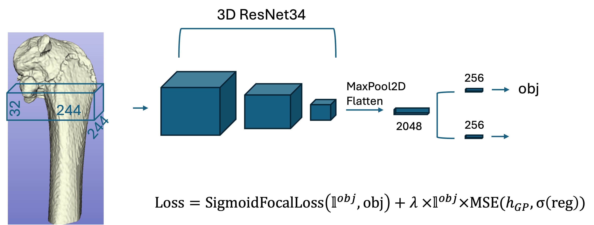

# SafetyNNet Approach
3D Convolutional sliding window approach is used to detect growth plate plane in 3D micro CT images in mice.


# Installation

Needed libraries are listed in environment.yml and can be installed with conda
```
conda env create -f environment.yml
``` 
```
source setup.sh
```
can be used to setup the python paths.

# Training


Training can be run using the following commant
```
python scripts/train_3dwindow_CV.py --config configs/config_train.json
```

Paths in the config should be adapted for the input data paths.
The script runs 5-fold CV where folds are defined in the input train_with_folds.csv file.

Initial ResNet34 weights can be downloaded from [MedicalNet](https://github.com/Tencent/MedicalNet)


# Inference
After the models are trained the inference can be run with
```
python scripts/run_inference.py --config configs/config_inference.json
```
that will create csv file with mean prediction, and json file with prediction for each checkpoint in the trained weights folder.

